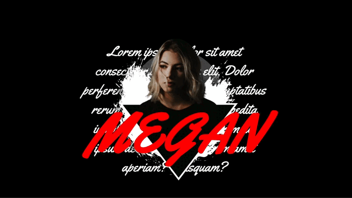

# user-portfolio-2
- mira la pagina en el siguiente link: [user-portfolio-2]( https://carloscruzvalencia.github.io/user-portfolio-2/)
## Links de interes
<!-- link a correo -->
<code> <a href="mailto:a2carcruzinfo@gmail.com"></a></code>
<code><a a href="https://www.figma.com/file/kP0SJhf4iDDa9kAzsz1LM1/Github-projects?node-id=0%3A1"></a></code>

## Tecnologias usadas
IDE
<!-- visual studio code -->
<code></code>

Otros programas usados
<!-- figma -->
<code></code><!-- gitkraken -->


lenguajes/frameworks usados

<!-- html -->
<code></code><!-- css -->
<code></code>
<code></code>
<code></img></code>

## Inpiracion del proyecto & objetivo
- El objetivo principal es aprender como hacer que un objeto persiga al raton/cursor

inspiracion del proyecto: carlos cruz valencia diseño en figma


## Estado del proyecto
|             ESTADO                |             |
| -------------------------- | :----------------: | 
| EN PROGRESO           |        ✔️      |  

## Vista previa del proyecto
</img>
<!-- </img> -->

## Licencia
Este proyecto está bajo la Licencia (MIT) - mira el archivo [LICENSE.md](LICENSE.md)  para mas detalles


## !codigo temporal¡
## git update code
```shell
git add -A && git commit -a -m \"update\" && git push
```

## sass compiler code
```shell
sass -w --style compressed assets/styles/sass/main.scss assets/styles/css/main.css
```